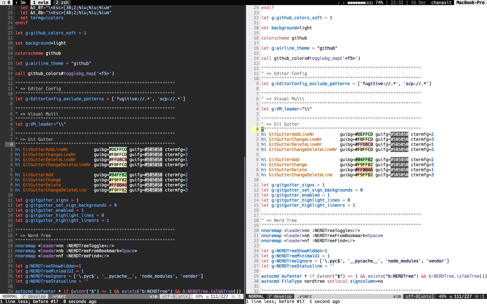
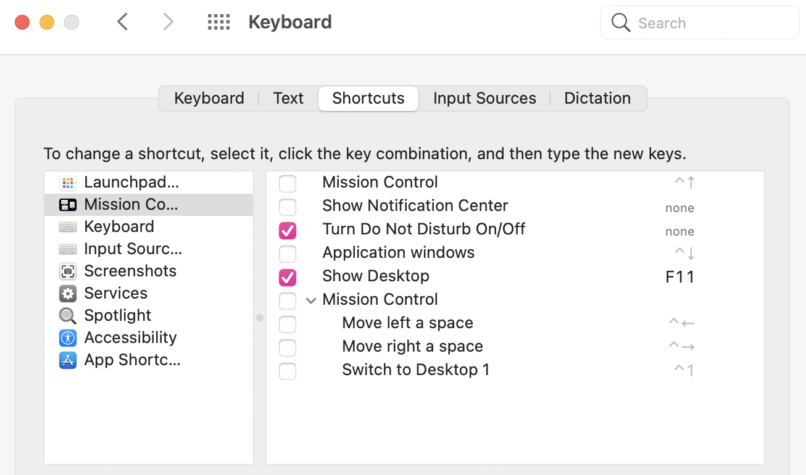

# My dotfile



## Basic setup required

- [brew](https://brew.sh/) (osx)

- disable missing control to work with [vim-visual-multi](https://github.com/mg979/vim-visual-multi) perfectly (osx)

 

## Installation with Makefile
Easy to build development environment with this command.
```
$ make install
```

Check make command description
```
$ make help
```
